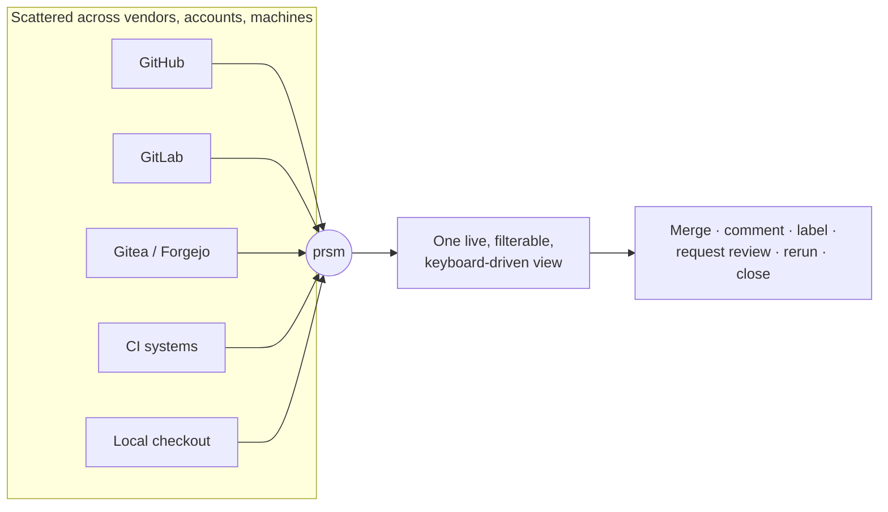
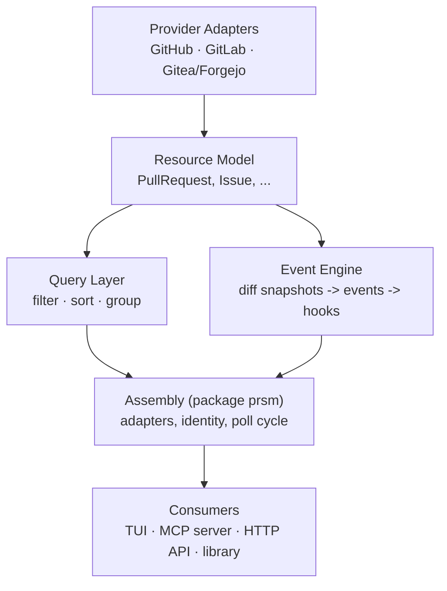

# prsm

Engineers lose time to code resources scattered across vendors, accounts, and machines — pull requests on one host, CI runs on another, branches and worktrees on disk. prsm centralizes them into one live, filterable, keyboard-driven surface, and lets you act on them from there.

v1 ships the pull-request slice — GitHub, GitLab, and Gitea/Forgejo aggregated into a single TUI. CI runs, branches, and worktrees are planned for later.

## Architecture

prsm is a vendor-agnostic resource aggregation layer with the TUI as its first consumer, not its product identity. Five layers with strict downward-only dependencies, plus a shared assembly layer between them and the consumers:

See [`CLAUDE.md`](CLAUDE.md) for the full project overview.
